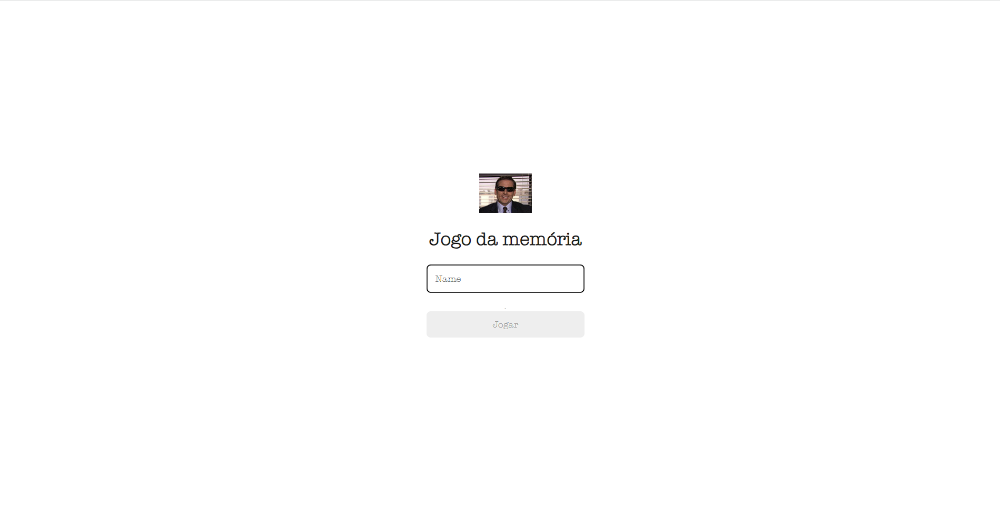

# Projeto Jogo da memória 

Projeto de um jogo da memória com o tema de The Office. 

## Índice 

- <a href="#layout">Layout </a>
- <a href="#tecnologias-utilizadas">Tecnologias Utilizadas</a>
- <a href="#como-acessar esse projeto">Como acessar esse projeto</a>
- <a href="#como-rodar-esse-projeto">Como rodar esse projeto</a>
- <a href="#autora">Autora</a>
- <a href="#proximos-passos">Próximos passos</a>
 
## Layout

## Tecnologias utilizadas

- HTML 
- CSS
- JavaScript

## Como acessar esse projeto

1. Beixe os arquivos 
2. Abra o Visual Studio Code 
3. Clique em File 
4. Clique Open file 
5. Selecione a pasta do arquivo 

## Como rodar esse projeto

Acesse a pasta *pages* e clique duas vezes no arquivo *index*

## Autora

[LinkedIn](https://www.linkedin.com/in/camila-marques-972791137/)

## Próximos passos

Criar Botão de iniciar o jogo.

Adicionar um ranking de jogadores.
 